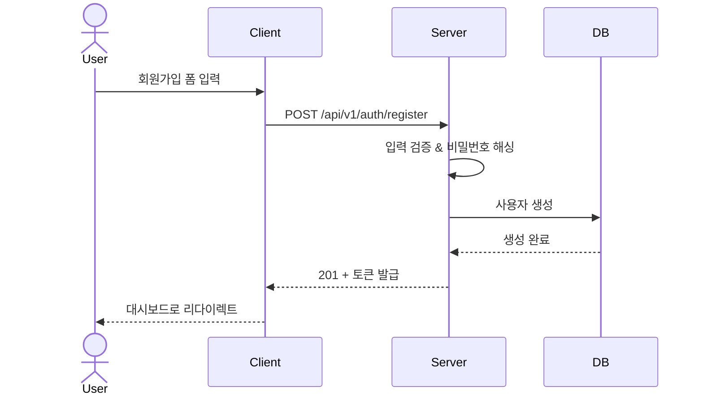
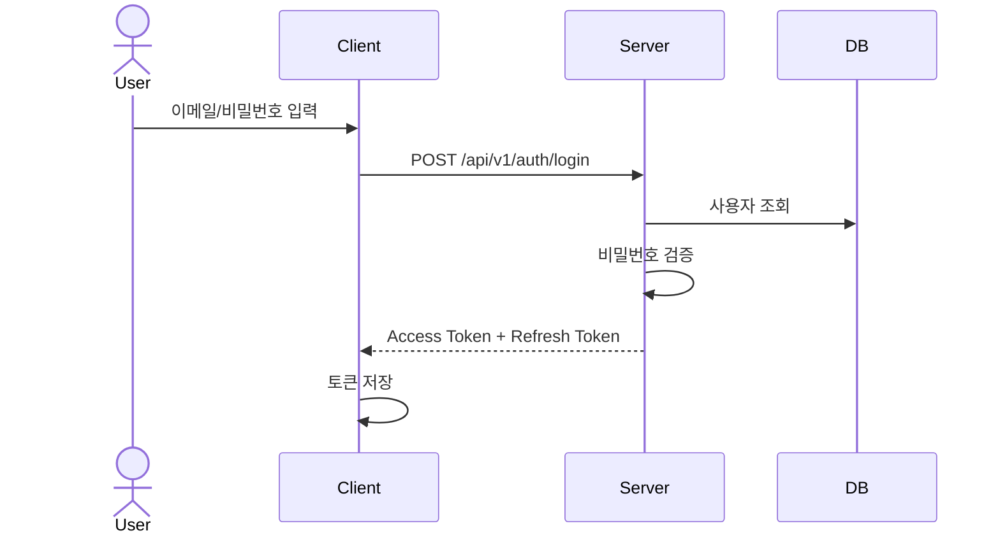
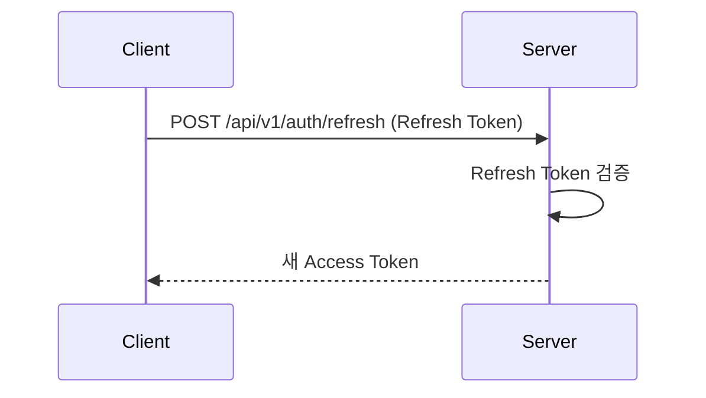

# 인증/인가 플로우 (Auth Flow)

<!-- 담당 에이전트: backend -->

## 1. 인증 방식
- **선택**: Session / JWT / OAuth2
- **사유**:

## 2. 인증 플로우 다이어그램

### 2.1. 회원가입

### 2.2. 로그인

### 2.3. 토큰 갱신

### 2.4. 로그아웃
- 클라이언트: 토큰 삭제
- 서버: Refresh Token 무효화 (블랙리스트)

## 3. 인가 (Authorization)
### 3.1. 역할 정의 (RBAC)
| 역할 | 설명 |
|------|------|
| admin | 전체 관리 권한 |
| user | 일반 사용자 |
| guest | 비로그인 |

### 3.2. 권한 매트릭스
| 리소스 | admin | user | guest |
|--------|-------|------|-------|
| | CRUD | R | R |

## 4. 소셜 로그인 (해당 시)
| 제공자 | Client ID 관리 | Callback URL |
|--------|---------------|-------------|

## 5. 보안 고려사항
- **XSS**: HttpOnly Cookie로 토큰 저장
- **CSRF**: SameSite Cookie + CSRF 토큰
- **Token 저장**: httpOnly secure cookie (권장) / Memory (대안)

## 변경 이력
| 일자 | 변경 내용 | 관련 기능 | 작성자 |
|------|----------|----------|--------|
