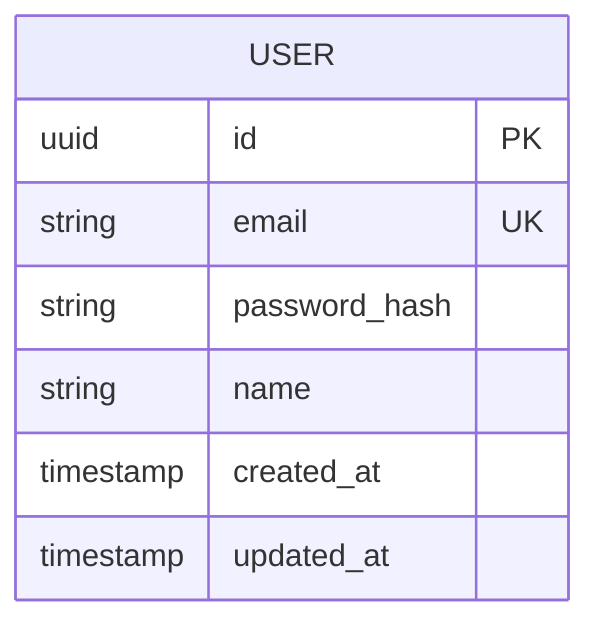

# DB 스키마 정의 (Database Schema)

<!-- 담당 에이전트: backend -->

## 1. DB 엔진 & 버전
- **엔진**:
- **버전**:

## 2. ERD (Entity-Relationship Diagram)

## 3. 테이블 정의

### users
| 컬럼 | 타입 | 제약조건 | 설명 |
|------|------|---------|------|
| id | UUID | PK, DEFAULT uuid_generate_v4() | |
| email | VARCHAR(255) | UNIQUE, NOT NULL | |
| created_at | TIMESTAMP | DEFAULT NOW() | |
| updated_at | TIMESTAMP | DEFAULT NOW() | |

## 4. 관계 정의
| 관계 | 타입 | FK | 설명 |
|------|------|-----|------|

## 5. 마이그레이션 전략
- **도구**: (Prisma Migrate / Knex / TypeORM)
- **규칙**: 마이그레이션은 항상 순방향 + 역방향(rollback) 정의
- **네이밍**: `YYYYMMDD_HHMMSS_description`

## 6. 시딩 데이터
- **개발용**: 기본 테스트 데이터
- **필수 시드**: 시스템 설정값, 역할 정의 등

## 7. 인덱스 전략
| 테이블 | 인덱스 | 컬럼 | 용도 |
|--------|--------|------|------|

## 변경 이력
| 일자 | 변경 내용 | 관련 기능 | 작성자 |
|------|----------|----------|--------|
