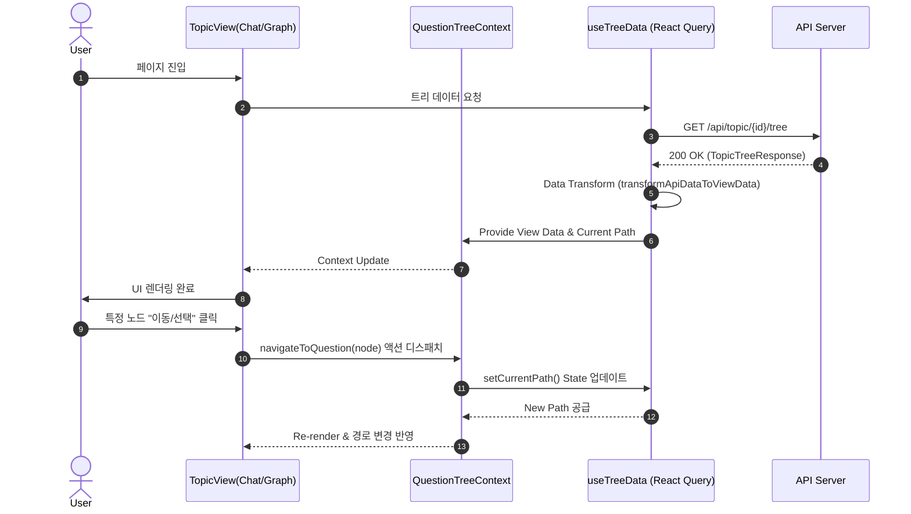
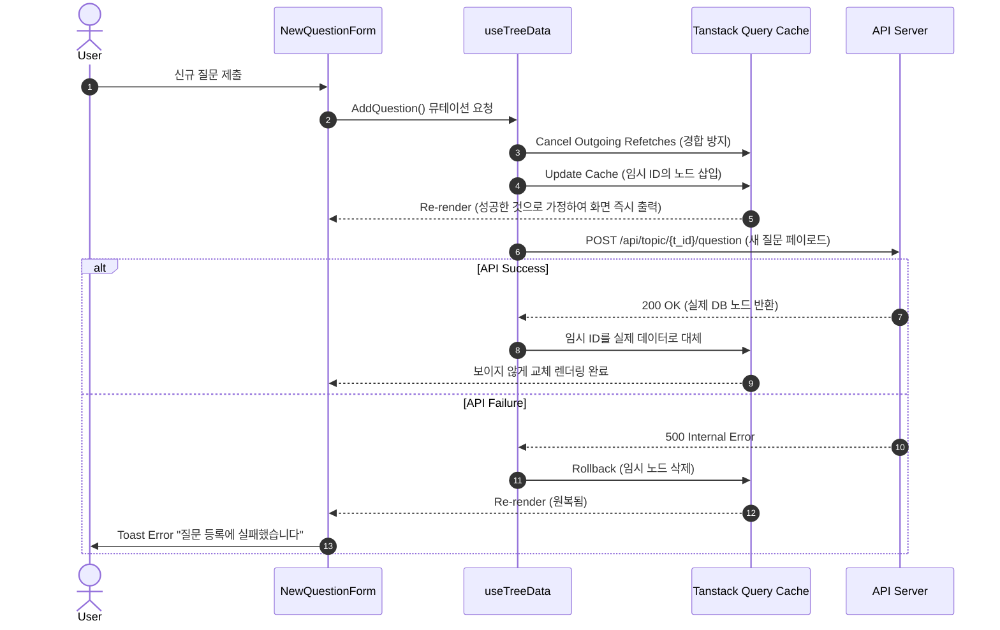

# Data Flow Diagrams (DFD)

본 문서는 `chatGraph-FE-local` 시스템 내부의 핵심적인 데이터 흐름을 다이어그램으로 명세합니다. 주요 동작은 "Topic 트리의 데이터 로드와 낙관적 탐색/업데이트" 메커니즘을 따릅니다.

## 1. Topic 탐색 및 렌더링 데이터 흐름 (Topic Data Flow)

API로부터 토픽/질문 구조를 불러오고, 컨텍스트를 거쳐 화면(채팅 뷰 및 그래프 뷰)으로 뿌려지는 메커니즘입니다.

## 2. 낙관적 업데이트 기반 (Optimistic) 엔티티 생성 흐름

새로운 질문/답변을 트리에 추가할 때 랙(Latency) 없이 화면에 먼저 나타나게 하는 흐름입니다.

