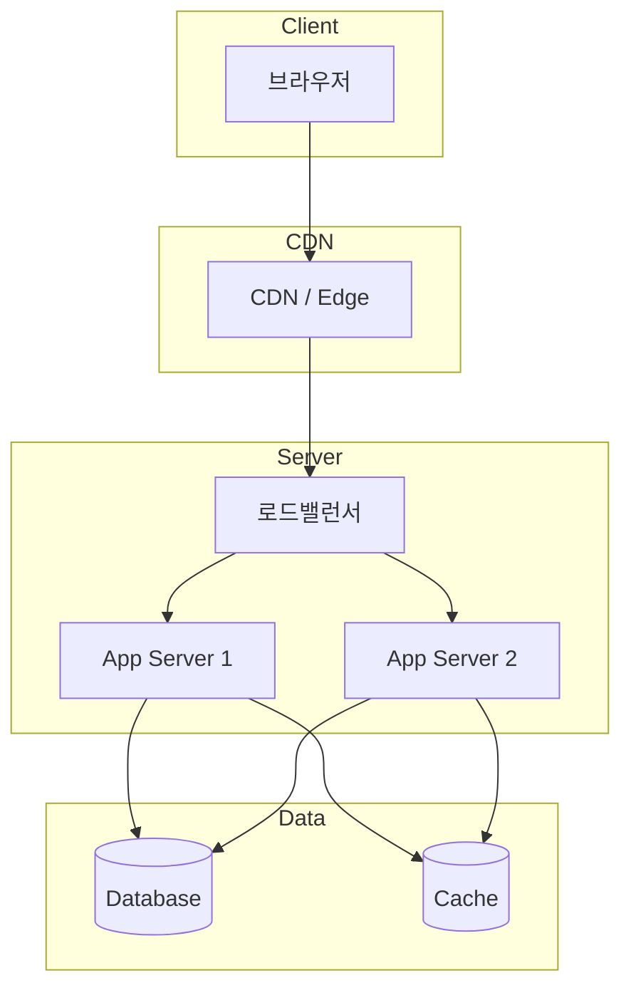
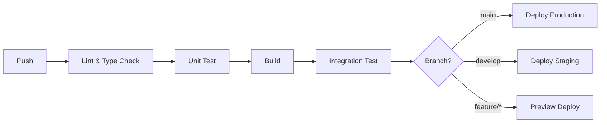

# 배포 아키텍처 (Deployment Architecture)

<!-- 담당 에이전트: backend -->

## 1. 환경 구성
| 환경 | 목적 | URL |
|------|------|-----|
| Development | 개발 | localhost |
| Staging | QA/테스트 | |
| Production | 운영 | |

## 2. 인프라 다이어그램

## 3. CI/CD 파이프라인

### 3.1. 빌드 단계
### 3.2. 테스트 단계
### 3.3. 배포 단계

## 4. 환경별 설정 관리
- 환경 변수 분리 (`.env.development`, `.env.staging`, `.env.production`)
- 시크릿: Secrets Manager / 환경 변수

## 5. 도메인 & SSL
- **도메인**:
- **SSL**: Let's Encrypt / Cloud Provider

## 6. 모니터링 & 로깅 인프라
| 항목 | 도구 | 목적 |
|------|------|------|
| APM | | 성능 모니터링 |
| Error | | 에러 추적 |
| Log | | 로그 집계 |
| Uptime | | 가용성 모니터링 |

## 변경 이력
| 일자 | 변경 내용 | 관련 기능 | 작성자 |
|------|----------|----------|--------|
