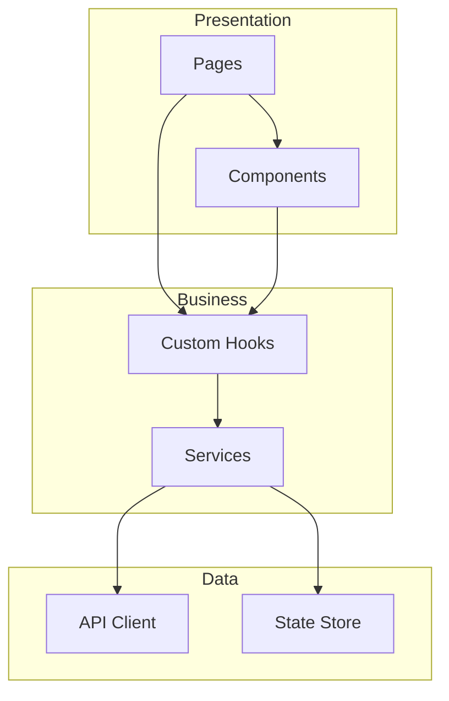

# 모듈 의존성 맵 (Module Dependency Map)

<!-- 담당 에이전트: frontend, backend -->

## 1. 모듈 목록 & 책임
| 모듈 | 레이어 | 책임 |
|------|--------|------|

## 2. 의존성 그래프


## 3. 레이어 다이어그램
```
┌─────────────────────────────────┐
│     Presentation Layer          │  Pages, Components, Layouts
├─────────────────────────────────┤
│     Business Logic Layer        │  Services, Hooks, Utils
├─────────────────────────────────┤
│     Data Access Layer           │  API Client, Store, Repository
├─────────────────────────────────┤
│     Infrastructure              │  DB, Cache, External APIs
└─────────────────────────────────┘
```

## 4. 순환 의존성 금지 규칙
- 상위 레이어 → 하위 레이어 참조만 허용
- 동일 레이어 간 참조는 인터페이스를 통해서만
- 하위 → 상위 참조 절대 금지

## 5. 모듈 간 통신 규약
- Props drilling 최소화 (3단계 이상 시 Context 또는 Store 사용)
- 이벤트 기반 통신 (해당 시)

## 변경 이력
| 일자 | 변경 내용 | 관련 기능 | 작성자 |
|------|----------|----------|--------|
