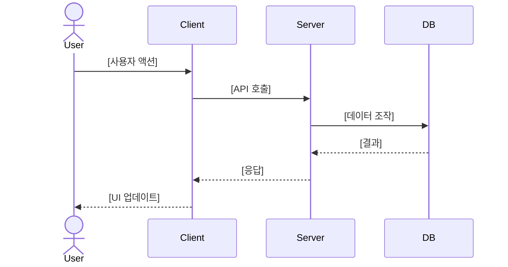
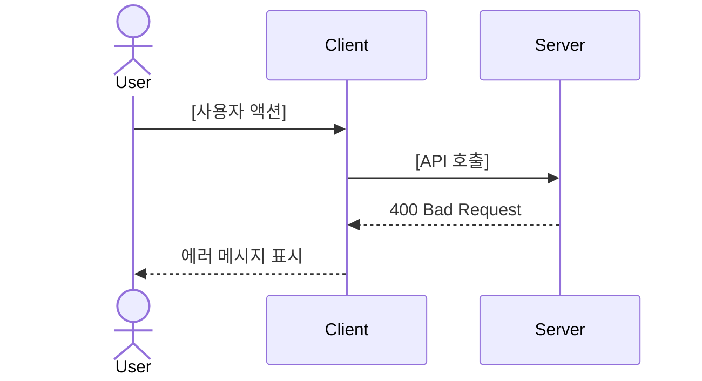

# 시퀀스 다이어그램 (Sequence Diagrams)

<!-- 담당 에이전트: frontend, backend -->

## 1. 주요 유스케이스 목록
| ID | 유스케이스 | 관련 에픽 | 상태 |
|----|----------|----------|------|

## 2. 유스케이스별 시퀀스 다이어그램

### UC-001: [유스케이스명]

#### 정상 플로우 (Happy Path)

#### 예외 플로우 (Error Path)

## 변경 이력
| 일자 | 변경 내용 | 관련 기능 | 작성자 |
|------|----------|----------|--------|
