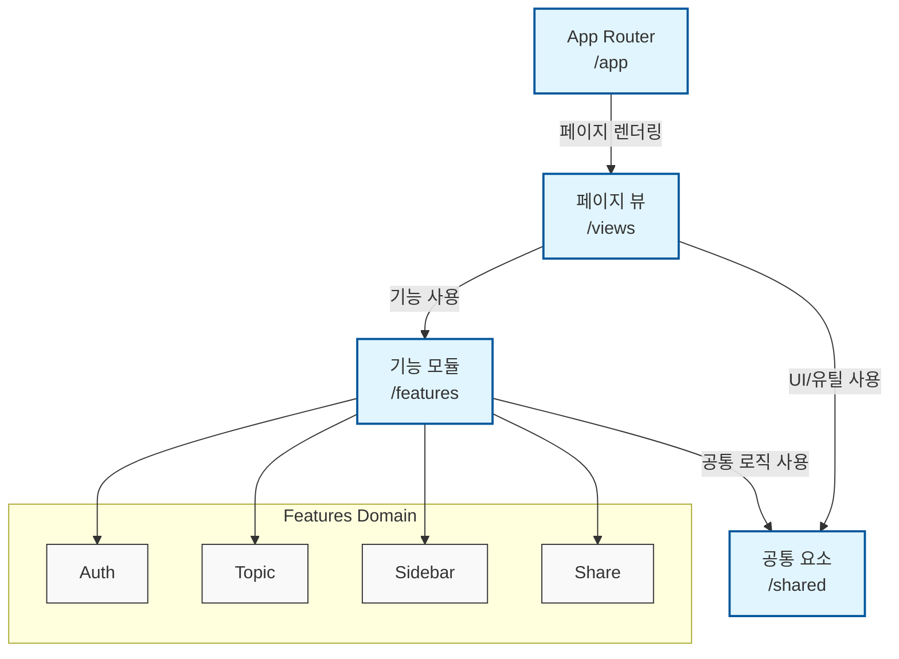
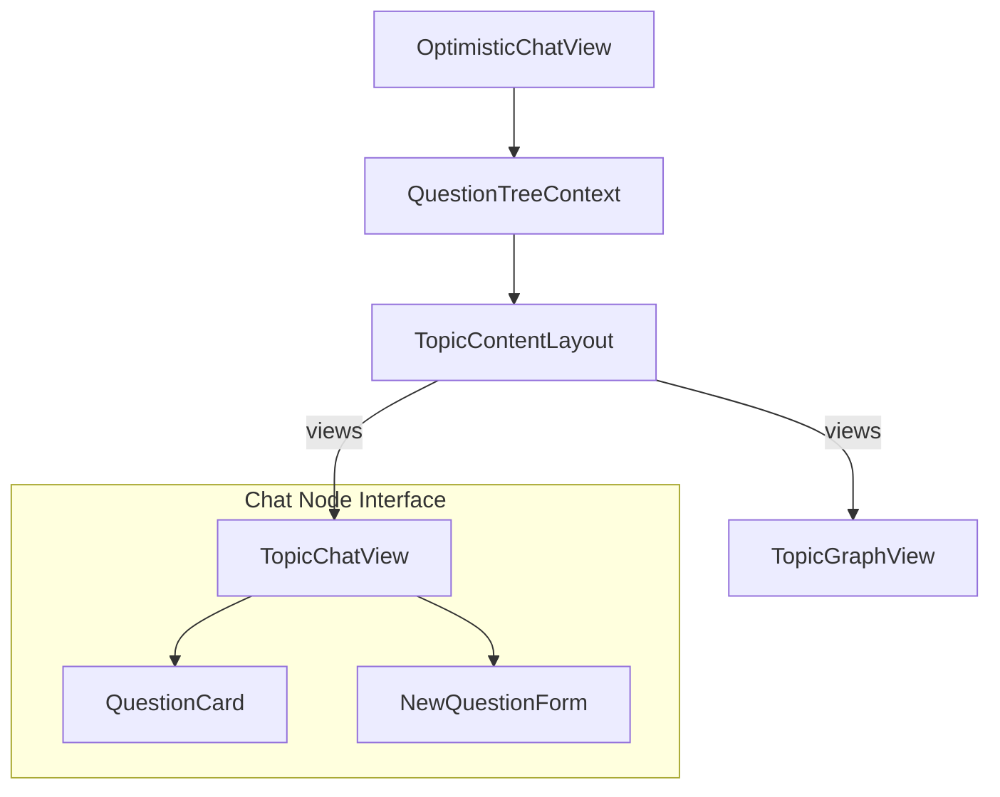

# System Handover & Overview

## 1. 프로젝트 요약
`chatGraph-FE-local`은 대화 및 질문으로 뻗어 나가는 트리를 선형적 뷰(Linear Chat)와 시각화 뷰(Network Graph) 모두로 조회, 탐색하고, 신규 대화를 생성할 수 있는 프론트엔드 시스템입니다. Next.js 15와 Feature-Sliced Design 철학에 따라 구축되었습니다.

## 2. 프론트엔드 시스템 맵 (System Map)

## 3. 핵심 비즈니스 도메인 (`features/topic`)

`topic`은 애플리케이션의 핵심 파트입니다. 해당 도메인 내의 컴포넌트 렌더링 구조는 다음과 같습니다.

## 4. 인수인계자 필수 숙지 사항
1. 이 프로젝트는 **Page 내부에 로직을 구현하지 않고** `views/`와 `features/`로 위임하는 것을 원칙으로 합니다.
2. D3 통합이나 신규 Graph 로직 추가 시, `TopicGraphView` 컴포넌트 단에 종속시키고 상태는 `QuestionTreeContext` 로부터 동기화시키십시오.
3. Tailwind CSS의 복잡한 조합은 항상 `clsx`를 통과하는 `cn()` 헬퍼 유틸을 통해 관리됩니다.
