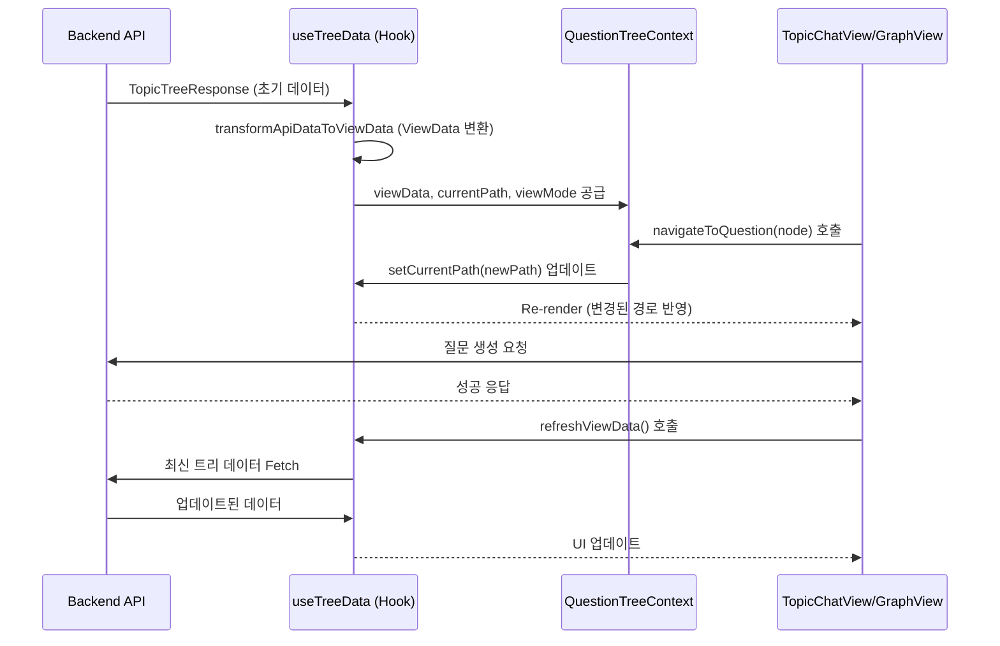

# Topic 기능 아키텍처 (Topic Feature Architecture)

이 문서는 `topic` 기능(대화 및 그래프 뷰)의 내부 구조와 데이터 흐름을 설명합니다.

## 컴포넌트 계층 구조 (Component Hierarchy)

대화 화면은 `OptimisticChatView`를 최상위로 하여 레이아웃과 구체적인 뷰(채팅/그래프)로 나뉩니다.

```mermaid
graph TD
    %% 주요 컴포넌트 정의
    Root[OptimisticChatView <br/> (데이터 Fetching & 초기화)]
    Context[QuestionTreeContext <br/> (상태 공급)]
    Layout[TopicContentLayout <br/> (뷰 모드 전환)]
    ChatView[TopicChatView <br/> (채팅 인터페이스)]
    GraphView[TopicGraphView <br/> (그래프 시각화)]
    Dialogs[TopicGlobalDialogs <br/> (모달 관리)]

    %% 구조 연결
    Root --> Context
    Context --> Layout
    Layout -->|모드: chat| ChatView
    Layout -->|모드: graph| GraphView
    Layout --> Dialogs

    %% 하위 컴포넌트 예시
    subgraph Chat_Components [Chat View Components]
        ChatView --> QuestionCard[QuestionCard]
        ChatView --> Input[NewQuestionForm]
    end

    %% 스타일링
    classDef container fill:#fff3e0,stroke:#e65100,stroke-width:2px;
    class Root,Layout container;
```

## 데이터 흐름 (Data Flow)

`topic` 기능의 핵심 데이터인 "질문 트리(Question Tree)"와 "현재 경로(Breadcrumb)"는 다음과 같이 관리됩니다.



## 주요 Hook 및 상태

| Hook / Store | 역할 |
|---|---|
| **`useTreeData`** | 토픽의 전체 트리 구조와 현재 탐색 경로(`currentPath`)를 관리하는 핵심 Hook입니다. |
| **`useTopicStore`** | (Global) 현재 선택된 토픽 ID와 이름을 전역적으로 동기화합니다. |
| **`useQuestionTree`** | `useTreeData`를 래핑하여 컴포넌트에서 더 쉽게 사용할 수 있도록 인터페이스를 제공합니다. |
